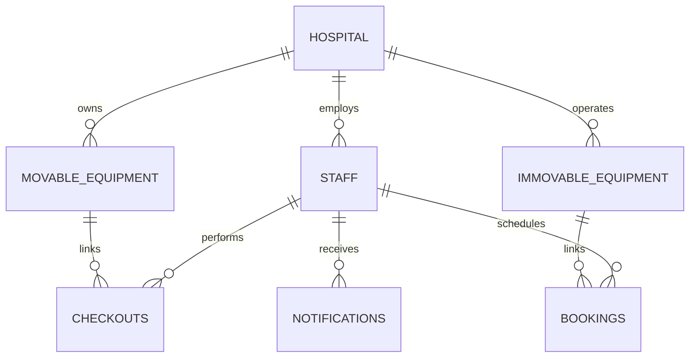

# 🏥 MedNexus: Engineering Walkthrough & Architecture

**MedNexus** is a state-of-the-art Healthcare Resource Management system. It transforms hospital operations by replacing manual logs with an intelligent, persistent, and emergency-aware digital ecosystem.

---

## 🏗️ 1. Technical Architecture

MedNexus is built on a **Full-Stack Persistent Architecture**, moving away from temporary browser storage to a professional relational database system.

### The Stack
- **Frontend**: Vanilla JS (ES6+), HTML5, CSS3 with a focus on Glassmorphism and clean, human-designed UI.
- **Backend API**: Spring Boot 3.2.3 (Java 21).
- **Database**: MySQL 8.0 (Relational storage for high data integrity).
- **Dev-Ops**: Node.js managed unified workflow with `concurrently`.

---

## 🧠 2. The Logic Engines

The project features three distinct "Intelligent Engines" that handle the complexity of hospital logistics.

### 🔴 Transactional Emergency Pushback Engine
This is the transactional scheduling core of the booking system:
- **Conflict detection**: When a booking is submitted, the backend verifies that the requested times fall within the equipment's operating hours and duration limits (Surgery: 8h, Dialysis: 6h, Default: 2h).
- **Auto-Rescheduling**: If a `High Emergency` booking conflicts with a lower-priority booking, the backend runs a transactional reschedule within MySQL, moving the displaced booking to the next available slot today.
- **Failsafe Alerting**: If no slot is found, the backend automatically cancels the conflicting booking and issues a critical alert notification for manual admin review.
- **Pessimistic Concurrency**: Uses `@Lock(LockModeType.PESSIMISTIC_WRITE)` to serialize concurrent booking requests on the same equipment and prevent double-booking race conditions.

### 🔔 Persistent Notification Engine
Unlike standard apps where notifications disappear on refresh, MedNexus uses a **Backend-First Notification System**:
- **SQL Persistence**: All alerts are stored in the `notifications` table.
- **Global Sync**: A "Mark as Read" action on the frontend updates the database state, maintaining consistency across all sessions.

### ⏰ Proactive System Scheduler
The backend contains a `SystemScheduler.java` that runs autonomously:
- **Overdue Detector**: Automatically flags any equipment that hasn't been returned by its due date.
- **Appointment Reminder**: Proactively notifies staff of upcoming bookings scheduled for today.

---

## 📊 3. Data Schema (Entity-Relationship)

MedNexus maintains strict data relationships to ensure Clinical Safety.

---

## 🚀 4. Workflow & Deployment

We have standardized the workflow to follow professional industry standards.

1. **Unified Startup**: A `package.json` at the root allows the whole system to start with `npm run dev`.
2. **Data Seeding**: A `DataSeeder.java` ensures the system comes pre-loaded with medical data but **protects user changes** by skipping synchronization if the database is already populated.
3. **Environment Security**: Database credentials and CORS policies are centralized in `application.properties`.

---

## 🔒 5. REST API Integration & Verification

To support robust clinical persistence, all frontend dashboards are fully connected to the Spring Boot REST API:
* **Booking Persistence**: Edited bookings use `PUT /api/bookings/{id}` and new bookings use `POST /api/bookings`. Conflicting bookings rescheduled during pushbacks are automatically saved to the server.
* **Notification Integration**: Custom staff alerts and failsafes are posted via `POST /api/notifications` to remain persistent across sessions.
* **Testing Validation**: All features (staff registration, asset checkouts, conflicts, pushbacks, and alert state persistence) have been validated using the `full_system_test.js` script against the live backend server.
